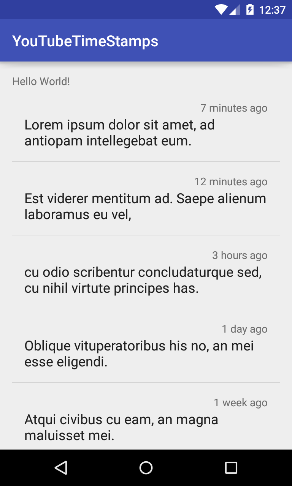

# YouTubeTimeStamps

  Creating comments with timestamps like YouTube (java.util.Date or JodaTime)

  This code is for a tutorial showing how you can create timestamped messages like the YouTube comments section. 
  What this means is we will convert the timestamp (date) that each message has been saved at into a human readable and rounded format. 
  For instance if today is 2016/02/14 17:00 and someone had commented at 2016/02/14:12:55 the message would be timestamped with "2 hours ago".
  
  
